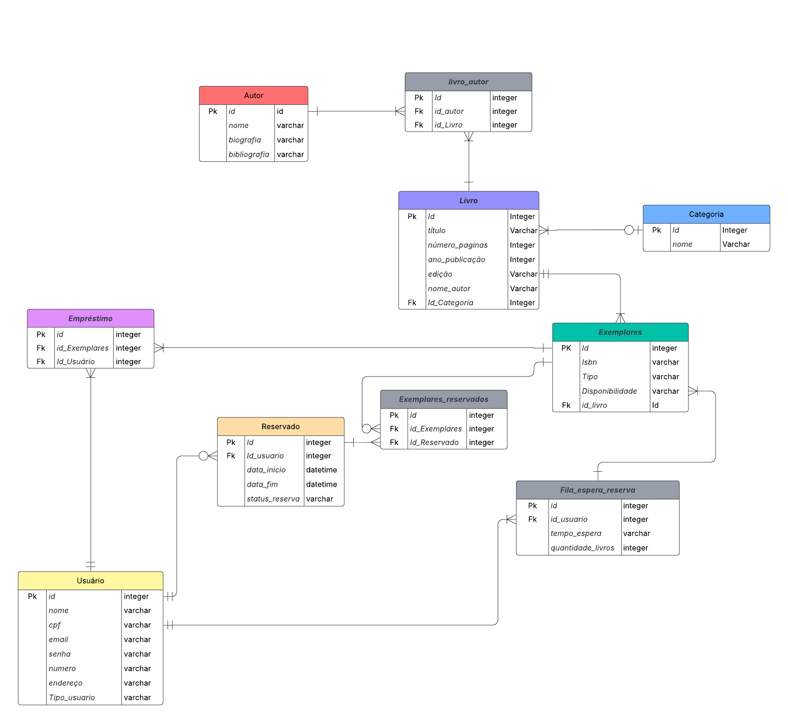

# Diagrama Entidade-Relacionamento: Nexus
## Visualização

# Especificações...
## Entidades e atributos
### Autor
id (PK),
nome,
biografia.

### Livro
id (PK),
titulo,
numero_paginas,
ano_publicacao,
edicao,
tipo,
categoria_id (FK).

### Categoria
id (PK),
nome,
Exemplares,
id (PK),
livro_id (FK),
disponibilidade.

### Usuario
id (PK),
nome,
cpf,
email,
senha,
endereco.

### Emprestimo
id (PK),
usuario_id (FK),
exemplar_id (FK),
data_inicio,
data_fim.

### Reservado
id (PK),
usuario_id (FK),
livro_id (FK),
status_reserva,
Exemplares_Reservados,
id (PK),
reservado_id (FK),
exemplar_id (FK).

### Fila_Espera_Reserva
id (PK),
usuario_id (FK),
livro_id (FK),
tempo_espera,
Livro_Autor,
livro_id (FK),
autor_id (FK).

# Descrição do Diagrama
### Este diagrama detalhado representa o sistema de gerenciamento de biblioteca, mostrando como os livros, autores, usuários, empréstimos, reservas e categorias estão interconectados. 
### Utilizamos PK e FK para: Chave primária e chave estrangeira respectivamente.
## Cardinalidade:
### Usuário – Reserva

Um usuário pode fazer muitas reservas,
 uma reserva pertence a um único usuário.

(Usuário 1,N — N,1 Reserva)

### Usuário – Empréstimo

Um usuário pode realizar muitos empréstimos,
 um empréstimo pertence a um único usuário.

(Usuário 1,N — N,1 Empréstimo)

### Usuário – Fila de Espera de Reserva

Um usuário pode estar em várias filas de espera,
 uma fila de espera pertence a um único usuário.

(Usuário 1,N — N,1 Fila_espera_reserva)

### Livro – Categoria

Uma categoria pode ter vários livros,
 um livro pertence a uma única categoria.

(Categoria 1,N — N,1 Livro)

### Livro – Autor (via entidade intermediária livro_autor)

Um livro pode ter vários autores,
 um autor pode escrever vários livros

(Livro N,N — N,N Autor)

### Livro – Exemplares

Um livro pode ter muitos exemplares,
 um exemplar pertence a um único livro.

(Livro 1,N — N,1 Exemplares)

### Exemplares – Empréstimo

Um exemplar pode estar em vários empréstimos ao longo do tempo (mas apenas um ativo de cada vez),
 um empréstimo sempre se refere a um exemplar específico.

(Exemplares 1,N — N,1 Empréstimo)

### Exemplares – Exemplares_reservados

Um exemplar pode estar em várias reservas,
 uma reserva sempre referencia um exemplar.

(Exemplares 1,N — N,1 Exemplares_reservados)

### Reserva – Exemplares_reservados

Uma reserva pode envolver vários exemplares,
 um exemplar_reservado pertence a uma única reserva.

(Reserva 1,N — N,1 Exemplares_reservados)00
